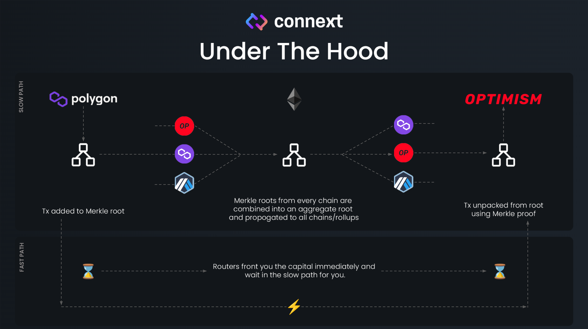

# How xERC20 Tokens Work with Connext

Connext combines the security of bridging through canonical bridges (Arbitrum, Optimism, etc.) into a single, easy to use, developer interface.&#x20;

Connext batches data associated with crosschain token transfers into merkle roots. These roots are passed to Ethereum L1 from each chain through canonical bridges, further batched on L1, and then passed back to each other chain. This forms a cheap, trust-minimized **message highway** through which you can communicate between chains.


For tokens specifically, Connext supports burning and minting across chains by communicating through the underlying messaging highway.


<figure><figcaption></figcaption></figure>

Messages through Connext that are passed through Ethereum can take 1-3 hours to arrive across chains, which is too slow to provide a great user experience. Connext routers (the node operators of our network), however, cut this time down to 45-180 seconds, by “fronting” liquidity to the user immediately, and being repaid by the protocol. Routers charge a 5 bps flat fee for this service.

## Why Connext?

Why should you use Connext for crosschain tokens? There are a few important ways that Connext is different from other options.

#### Security

Connext has a long history of prioritizing security and trust-minimization over all else.

* By delegating crosschain message verification to canonical bridges, Connext is the **only** messaging bridge that gives users the trust guarantees of the underlying chain. For cases where no canonical bridge is available, Connext expects to plug into something like [Hashi](https://ethresear.ch/t/hashi-a-principled-approach-to-bridges/14725).
* The latest upgrade of Connext has been [rigorously audited](https://github.com/connext/audits), and features a system of watchers that monitor usage and [proactively pause the network if they detect problems](https://github.com/connext/monorepo/tree/main/packages/agents/watcher).

#### Sovereignty & Fungibility

Unlike other token bridges, Connext prioritizes giving you sovereign control over your projects’ assets.

* We advocate for you to deploy and retain control over your own token implementations on each chain. This means you retain the ability to delist Connext if we’re not fulfilling your needs or list other bridges if you’d like to have multiple options.
* **\[Coming soon]** With the above, we also make it possible for our token to be fungible against token representations deployed by the canonical bridges themselves. This means that regardless of whether a user sends a token through Connext to Optimism, or through the official Optimism Bridge, they are guaranteed to get the same asset.

## Additional Resources

* [Developer Documentation](https://docs.connext.network)
* [Connext xERC20 Tokens Setup Guide](https://www.notion.so/Public-xTokens-Setup-Guide-be4e136a6db14191b8d61bd60563ebd0?pvs=21)

Please contact [@maxlomu](https://t.me/maxlomu) or [@arjunbhuptani](https://t.me/arjunbhuptani) on Telegram if you have any questions!
