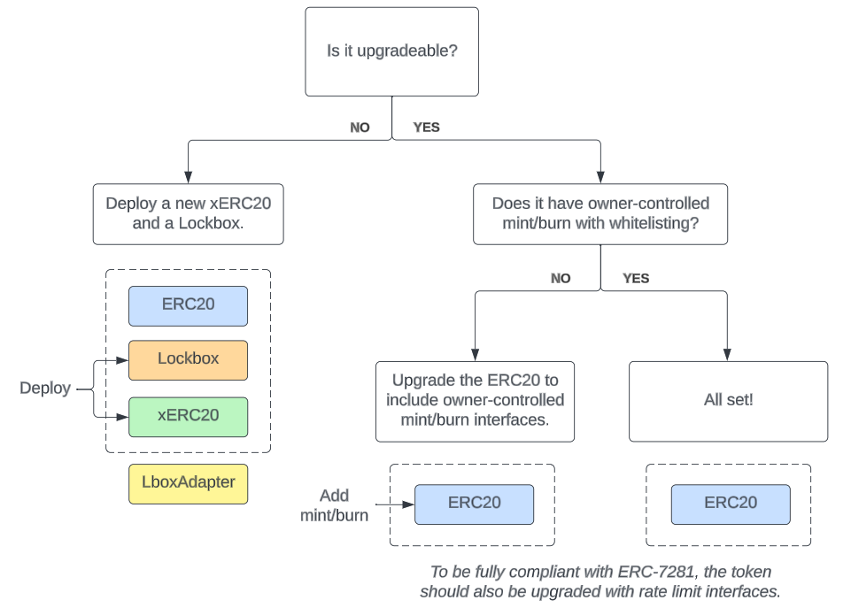

# Setup Guide

Hello! 👋 This document will guide you through the process of setting up your `xERC20` token with Connext.

## Prerequisites

Let's begin by getting a comprehensive understanding of the required steps based on your token's current situation.

#### 1. Categorize your token

Determine which of the following categories best describes your token's current state.

* **Category A**: The token is new and is not deployed anywhere.
* **Category B**: The token already exists on one chain.
* **Category C**: The token already exists on multiple chains.


If you want to spin up an `xERC20` on testnet, the category may be different from your mainnet token. We recommend emulating your mainnet token setup if your goal is to testrun the process on testnet.\
\
For example: on mainnet, your token `TKN`is deployed to Ethereum already (**Category B**). Then on testnet, you should deploy a `TKN` to Goerli and follow the steps for a **Category B** token.


#### 2. Define your token's "home" chain

Based on your token's category:

* **Category A**: Choose one chain to be the home chain.&#x20;
* **Category B**: The chain where your token is currently deployed will be the home chain.&#x20;
* **Category C**: Choose one chain (among the ones your token is currently deployed) to be the home chain.

#### 3. Prepare to deploy tokens

* **Category A**:
  * You will deploy an `xERC20` on each chain you wish to support, including the home chain.
* **Category B** and **Category C**:
  * On each chain with an existing token, you need to figure out if a Lockbox setup is needed (next section).
  * You will deploy an `xERC20` to all other chains you wish to support.

## Lockbox Setup

A Lockbox allows any existing ERC20 to become compatible with the ERC-7281 (xERC20) standard. The Lockbox is just a simple wrapper contract, analogous to Wrapped ETH.

For **Category B** and **Category C**, there are tokens that already exist on certain chains. For each of these tokens, follow this flowchart to determine if you need to have a Lockbox setup on that token's chain.

<figure><figcaption></figcaption></figure>

#### Example: NEXT token

To better understand how a Lockbox setup operates, consider the `NEXT` token as a real-world example.

* On Ethereum: Both the `NEXT` token and `xNEXT` token are deployed with a `Lockbox`.
* On Arbitrum: Only the `xNEXT` token is deployed.

Bridging from Ethereum to Arbitrum:

* \[Ethereum] User deposits `NEXT` into the Lockbox and receives `xNEXT`
* \[Ethereum] User calls the bridge using `xNEXT`&#x20;
* \[Arbitrum] Bridge delivers `xNEXT` to the user

Bridging from Arbitrum to Ethereum:

* \[Arbitrum] User calls the bridge using `xNEXT`
* \[Ethereum] Bridge withdraws `NEXT` from the Lockbox using the bridged `xNEXT`
* \[Ethereum] Bridge delivers `NEXT` to the user

## Deploying Contracts

Now that you have an idea of how your tokens should be set up, let's move on to the actual deployment procedures.&#x20;

#### xERC20s and Lockboxes

Connext provides an [xERC20 Github repository](https://github.com/connext/xERC20) that contains fully compliant implementations of `xERC20`, `Lockbox`, and scripts to deploy them. We suggest you deploy from a fork of this repo. See the `README` for instructions. You will configure the scripts based on which chains you need to have Lockbox setups.


The [ERC-7281](https://github.com/ethereum/EIPs/pull/7281) specification requires compliant tokens to implement ERC-20 along with mint/burn and some additional rate limit interfaces. The absolute _minimal_ interface needed is the ERC-20 interface plus mint/burn:

```solidity
/**
 * @notice Mints tokens for a user
 * @dev Can only be called by a bridge
 * @param _user The address of the user who needs tokens minted
 * @param _amount The amount of tokens being minted
 */
function mint(address _user, uint256 _amount) external;

/**
 * @notice Burns tokens for a user
 * @dev Can only be called by a bridge
 * @param _user The address of the user who needs tokens burned
 * @param _amount The amount of tokens being burned
 */
function burn(address _user, uint256 _amount) external;
```


#### LockboxAdapter

You might have noticed there's a `LockBoxAdapter` contract as well in the diagram above when you have a Lockbox setup. This contract facilitates the unwrapping of `xERC20 -> ERC20` on the destination chain. This way, bridge UIs can deliver the asset that the user expects to get on the Lockbox chain.

You can deploy a simple Lockbox adapter like [this one](https://github.com/connext/chain-abstraction-integration/blob/next-lockbox-adapter/contracts/integration/Connext/NextLockboxAdapter.sol).

#### Whitelisting bridges

As the token issuer, you have the power to decide which bridges can mint/burn your token and the ability to set rate limits for per bridge:

```
/**
 * @notice Updates the limits of any bridge
 * @dev Can only be called by the owner
 * @param _mintingLimit The updated minting limit we are setting to the bridge
 * @param _burningLimit The updated burning limit we are setting to the bridge
 * @param _bridge The address of the bridge we are setting the limits too
 */
function setLimits(address _bridge, uint256 _mintingLimit, uint256 _burningLimit) external;
```

These limits will replenish after`_DURATION` (by default the repo deploys `xERC20` with a value of 1 day).

Once your token is deployed to all the chains and assuming you want Connext to be able to bridge your token, please whitelist Connext by calling `setLimits`. You can find all Connext contract addresses in [Deployments](../../resources/deployments.md).

## Getting Allowlisted For Connext

Your tokens need to be allowlisted in Connext before the protocol can know to mint/burn them across chains. This process involves submitting two PRs:

1.  The first PR must be submitted to our [ChainData mappings](https://github.com/connext/chaindata/blob/main/crossChain.json).

    * For each chain in the mappings that your token is deployed to, add an object that looks like the following, keyed by your token address. Note that the `mainnetEquivalent` field refers to your asset’s address on Ethereum L1 - this is used to retrieve oracle pricing data in the cases where it is relevant. If your token is not deployed to Ethereum L1, feel free to leave this field blank.

    ```json
    "0x4c781E4D22cfaAdA520cAe4aF9097C5ecf9C3A71": {
      "name": "xDappRadar",
      "symbol": "xRADAR",
      "mainnetEquivalent": "0x44709a920fccf795fbc57baa433cc3dd53c44dbe",
      "decimals": 18
    }
    ```
2.  The second PR must be submitted to [our allowlisting scripts](https://github.com/connext/monorepo/blob/main/packages/deployments/contracts/src/cli/init/config/testnet/production.ts).

    * Each representation is indexed by domain (a Connext-specific identifier per chain that exists for forward compatibility with non-evm chains). [You can find a list of domains here](broken-reference).
    * Under `canonical,` the domain must be set to `11111` and the `address` used here should be your home chain's `xERC20`. It will be used again under `representations`.
    * For example, `RADAR`'s home chain is Ethereum and its `xERC20` token is configured under `representations`in Ethereum's domain ID `6648936`. It is also set under `canonical` in the domain ID `11111`.

    ```json
    {
      name: "RADAR",
      canonical: {
        domain: "11111",
        address: "0x202426c15a18a0e0fE3294415E66421891E2EB7C",
        decimals: 18,
      },
      representations: {
        /// ETHEREUM
        "6648936": {
          local: "0x202426c15a18a0e0fE3294415E66421891E2EB7C",
          adopted: "0x202426c15a18a0e0fE3294415E66421891E2EB7C",
        },
        /// BSC
        "6450786": {
          local: "0x489580eB70a50515296eF31E8179fF3e77E24965",
          adopted: "0x489580eB70a50515296eF31E8179fF3e77E24965",
        },
      },
    },
    ```


📌 Please reference the ChainData PR in your PR to our allowlisting scripts to make it easier for the reviewer!


Once this is done, the Connext Labs team will review your PRs to sanity check deployment details. Once your PR is approved, your tokens will be whitelisted and transferrable across chains!

## ConnextScan and Bridge Support

To make it easier to test and track your token transfers, we recommend adding your token to ConnextScan (the Connext network explorer) and the Connext Bridge. You’ll need to submit two more PRs for this:

1.  Submit a PR to [the ConnextScan repository config](https://github.com/CoinHippo-Labs/connextscan-ui/blob/main/config/testnet/assets.json).

    * `RADAR` as an example:

    ```json
    {
      "id": "radar",
      "symbol": "RADAR",
      "name": "DappRadar",
      "image": "/logos/assets/radar.png",
      "is_xERC20": true,
      "is_stablecoin": false,
      "contracts": [
        {
          "contract_address": "0x44709a920fCcF795fbC57BAA433cc3dd53C44DbE",
          "chain_id": 1,
          "decimals": 18,
          "symbol": "RADAR",
          "xERC20": "0x202426c15a18a0e0fE3294415E66421891E2EB7C",
          "lockbox": "0xFf6792A39F44FB67B4796906a5Cb77C677328858",
          "lockbox_adapter": "0x6ea3dc2e17a0466b36dd3258574e0bd2e4685452"
        },
        {
          "contract_address": "0x489580eB70a50515296eF31E8179fF3e77E24965",
          "chain_id": 56,
          "decimals": 18,
          "symbol": "RADAR"
        }
      ],
      "color": "#009DFF",
      "group": "other_tokens"
    }
    ```
2.  Submit a similar PR to the [Bridge repository config](https://github.com/CoinHippo-Labs/connext-bridge/blob/main/config/testnet/assets.json).

    * `RADAR` an example:

    ```json
    {
      "id": "radar",
      "symbol": "RADAR",
      "name": "DappRadar",
      "image": "/logos/assets/radar.png",
      "is_xERC20": true,
      "contracts": [
        {
          "contract_address": "0x44709a920fCcF795fbC57BAA433cc3dd53C44DbE",
          "chain_id": 1,
          "decimals": 18,
          "symbol": "RADAR",
          "xERC20": "0x202426c15a18a0e0fE3294415E66421891E2EB7C",
          "lockbox": "0xFf6792A39F44FB67B4796906a5Cb77C677328858",
          "lockbox_adapter": "0x6ea3dc2e17a0466b36dd3258574e0bd2e4685452"
        },
        {
          "contract_address": "0x489580eB70a50515296eF31E8179fF3e77E24965",
          "chain_id": 56,
          "decimals": 18,
          "symbol": "RADAR"
        }
      ],
      "color": "#009DFF"
    },
    ```

And that’s it! Once these PRs are merged, you'll have your token appear on [https://connextscan.io](https://testnet.connextscan.io) and [https://bridge.connext.network](https://testnet.bridge.connext.network).

## Router Liquidity

At this point, your token should be transferrable across chains with no added fees or slippage. However, because of how Connext’s model works, these transfers will happen in large batches through Ethereum L1 roughly once every 2-3 hours.


💡 Learn more about [fast and slow path execution here](../../concepts/how-it-works/transaction-lifecycle.md).


If your usecase requires fast (i.e. <2 minute) transfers across chains, you will need some routers in our network to supply some liquidity to execute transactions immediately on behalf of users.

Please reach out to the Connext team and we can help work through options here with our router partners.
